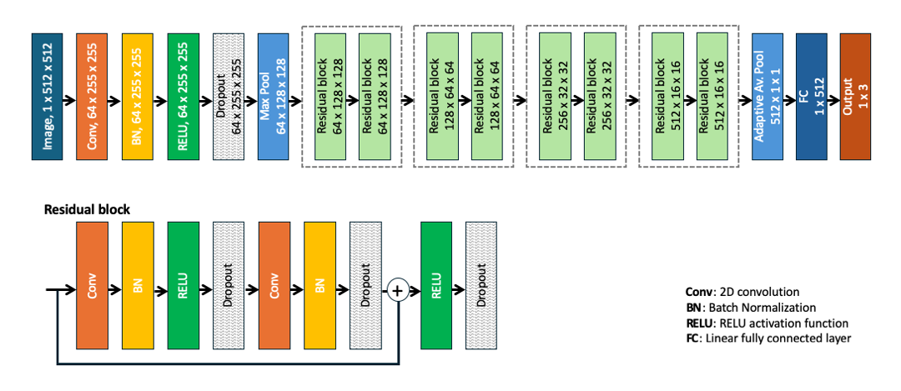
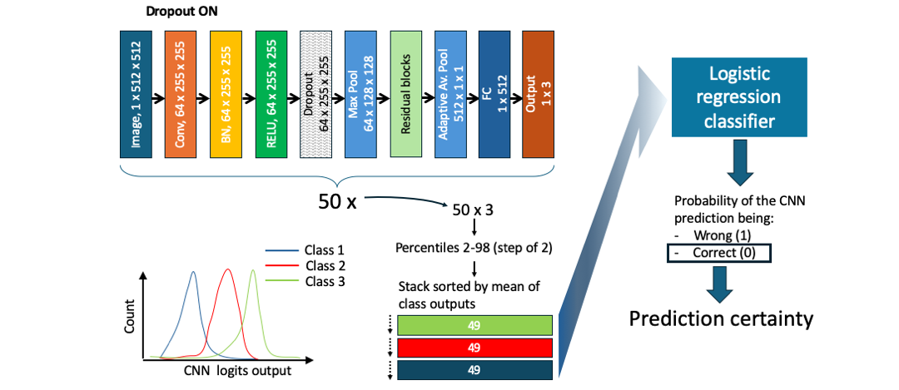

# Model card

## CNN Model description

**Input**: Single channel brain MRI images representing a 2D slice of an MRI scan, of any size.

**Output**: The type of tumor present in the input image, from 3 possible classes: Meningioma, Glioma or Pituitary tumor. 

**Model architecture**: I picked a commonly used CNN architecture, the ResNet18, to classify different types of brain tumors in MRI images. This choice was motivasted by the previously demonstrated success of ResNet architectures in image classification tasks (REF). The moderate depth of the network (18 layers) provided a good compromise between classification performance and computational resources. To enable Monte Carlo dropout for certainty estimation I added dropout layers downstream of every activation layer, as depicted below.

## MC dropout-based certainty estimator

**Input**: Sample of dropout predictions from the CNN, as depicted below.

**Output**: Prediction certainty

**Model type**: I used a logistic regression classifier to predict wether a CNN prediction is correct or wrong. This choice was motivated by the known ability of this type of models to output a probability, such that the probability of an instance to belong to the class "correct" is a direct estimate of CNN prediction certainty.

## High level features-based certainty estimator

**Input**: High level features from the CNN, taken as the output of the fully connected layer, as depicted below.

**Output**: Prediction certainty

**Model type**: As explained above, I used a logistic regression classifier to predict wether a CNN prediction is correct, which is a direct estimation of certainty.

