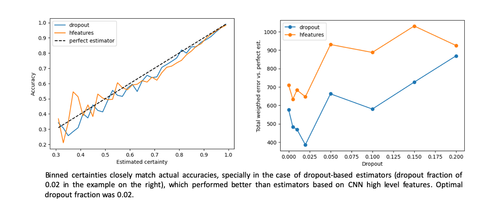
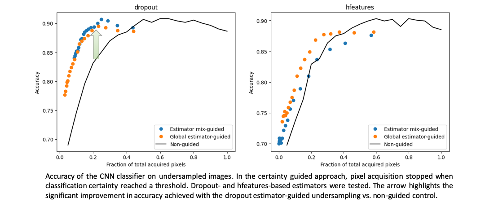

# Certainty estimator: extracting prediction certainty from a neural network image classifier

## Motivation
Neural networks have achieved human-like performance in numerous image classification tasks, but interpreting their outputs remains a challenge. The ability for an AI model to convey the certainty (probability of being correct) of its predictions is key in many situations, such as:

- Identification of ambiguous images that may lead to erroneous outcomes or diagnosis in medical imaging;

- Monitoring AI models in production, where tracking a model's uncertainty can help detect when it starts to degrade or encounters data shifts, flagging when retraining or intervention is necessary;

- Active sampling algorithms like reinforcement learning, Bayesian optimization, and active learning, where it guides exploration. In these contexts, models prioritize uncertain or under-explored areas of the input space to improve learning efficiency. These principles can be applied, for example, on the acceleration of MRI image acquisition and/or of the decisions derived from such data.

Thus, incorporating uncertainty estimation into neural networks is crucial for robust, interpretable, and efficient AI systems.

Although several methods have been proposed to deal with this issue, their implementation is typically not straightforward, or not reliable enough [1,2]. In this project I demonstrate a simple and effective way to implement certainty estimation on the predictions of a neural network which can be incorporated in any architecture.

## Repository structure

In this repository, I first train a neural network to classify tumors in a publicly available dataset. Then, I train and test certainty estimation approaches and finalize by showing a proof of concept for the application of certainty estimation in a real-world scenario. Detailed information on model implementations and on the dataset are incorporated in dedicated files and all steps are documented in jupyter notebooks, as follows:

Information on models and dataset:
- [model card](/Model_card.md)
- [data sheet](/data_sheet.md)

Ordered description of model training and testing/application:
- [Training CNN](/notebooks/1_Training.ipynb)
- [Training and testing certainty estimators](/notebooks/2_Certainty_estimators.ipynb)
- [Certainty estimator for active sampling applications](/notebooks/3_Certainty_active_sampling.ipynb)
- [Application of certainty estimation in undersampling](/notebooks/4_Undersampling.ipynb)

Notebook-specific code is kept within the respective notebook, whereas functions or classes shared across notebooks are defined in python scripts in the folder [utils](/utils/).

## Model implementation at a glance

I picked a commonly used CNN architecture, the ResNet18 [3], to classify different types of brain tumors in MRI images. Training was performed using dropout in all layers, which served mainly as a basis for certainty estimation during inference. For more detailed information on the model and dataset please check the [model card](/Model_card.md) and [data sheet](/data_sheet.md), respectively.

### Monte Carlo dropout-based certainty estimation
Monte Carlo (MC) dropout has been proposed as a method to estimate neural network model prediction uncertainty [4]. In this approach, dropout used during training is kept on during inference, enabling the sampling of multiple slightly different CNN outputs. The end-result is a distribution of CNN outputs for each class, instead of the typical deterministic CNN output consisting of a single value per class. 

Certainty, can then, in principle, be extracted from metrics derived from the MC dropout samples, such as its standard deviation [4]. However, it is often not straightforward to derive the most informative of such metrics and translate it into a certainty value. To circumvent this problem, I trained a logistic regression model to predict whether the CNN prediction is correct, having the MC dropout samples as input, as schematized below. Remarkably, the output of the logistic regression estimator can be given as a probability, corresponding to an estimation of the CNN prediction certainty. 

### High level features-based certainty estimation
Instead of the MC dropout output, which requires many forward passes through the CNN, an alternative method has been proposed to calibrate the softmax output of a CNN, such that it better reflects certainty. It takes the distance between high-level features derived for each image as input to train a detector that lowers the confidence output of potentially misclassified samples [5]. Here, I implemented a modified version of this strategy by using the output of the fully connected layer (high-level features) to train a logistic regression model directly on the estimation of prediction certainty, as depicted below.

## Main outcomes
The results show that both methods can provide a decent estimate of CNN prediction certainty, but MC dropout-estimators are overall better than high level features-estimators, which tend to overfit on the training data. My tests show that certainty estimation is robust over a wide range of image corruption levels. However, extreme corruption, that significantly decreases CNN accuracy, leads to disruption of certainty estimation. 

Given its easy and effective implementation, this approach holds potential to complement AI model pipelines in real-world scenarios, providing a simple way to extract prediction certainty. Check the results [here](/notebooks/2_Certainty_estimators.ipynb).

### Real-world application on the acceleration of MRI image-based diagnostics
As a proof of concept, I simulated a real-world application of certainty estimation to accelerate MRI image-based diagnostics through undersampling(please check it [here](/notebooks/4_Undersampling.ipynb). The goal was to classify MRI images accurately while minimizing the number of acquired pixels, addressing the time-intensive nature of traditional full-scan MRI. By stopping the image acquisition process once classification certainty reaches a predefined threshold, I demonstrate that the trade-off between data acquisition and classification accuracy can be significantly improved, leading to faster diagnostics.

The results underscore the benefits of integrating certainty estimation into AI model pipelines, showcasing its potential to enhance high-throughput, AI-powered MRI diagnostics. This approach is particularly relevant to emerging applications in industries such as agriculture and poultry, where MRI-based imaging is beginning to play a role.

## Literature

1 - [A survey of uncertainty in deep neural networks](https://link.springer.com/article/10.1007/s10462-023-10562-9)

2 - [On Getting Confidence Estimates from Neural Networks](https://bharathpbhat.github.io/2021/04/04/getting-confidence-estimates-from-neural-networks.html)

3 - [Deep Residual Learning for Image Recognition](https://arxiv.org/abs/1512.03385)

4 - [Dropout as a Bayesian Approximation: Representing Model Uncertainty in Deep Learning](https://arxiv.org/abs/1506.02142)

5 - [Predicting neural network confidence using high-level feature distance](https://www.sciencedirect.com/science/article/abs/pii/S095058492300068X)